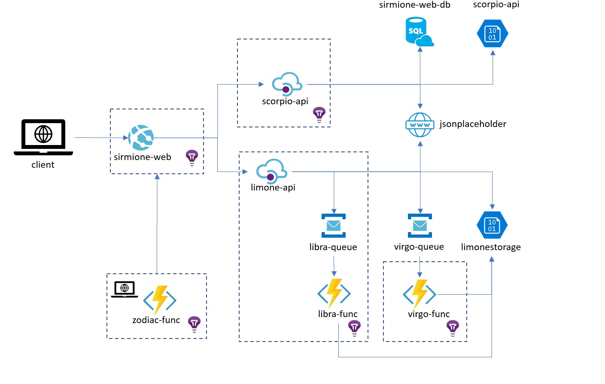

# zodiac
Zodiac is a microservices application that exists solely to generate telemetry for understanding and demonstrating Microsoft Application Insights.  

I have decided to make this available as an open source project on GitHub and in doing so learn a little more about GitHub actions. Over time, it would be great if others could contribute and build out to cover different hosting options and more of the infrastructure monitoring :-)

For a better description of the apllication see the [microservices description](microservices.md). To create your own working instance of zodiac, see [deploying zodiac](.github/workflows/README.md).
